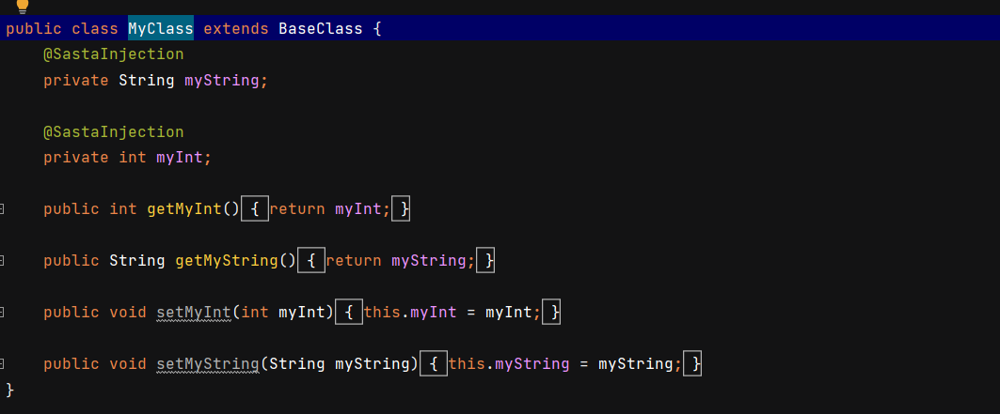
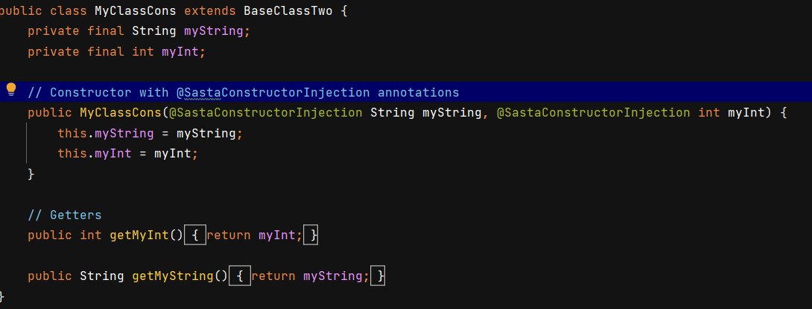
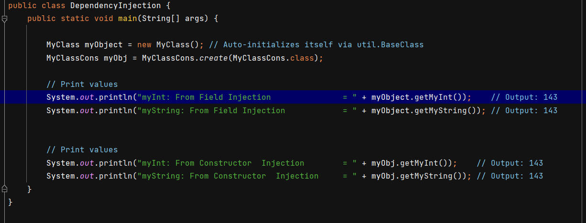
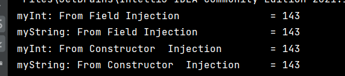

# 🚀 Sasta Dependency Injection (Java)

## Introduction

This project demonstrates **Dependency Injection (DI) in Java** using **reflection**. It features two custom annotations:

- **`@SastaInjection`** → Used for **field injection**
- **`@SastaConstructorInjection`** → Used for **constructor injection**
- It's a play project to understand how reflection can be used to do DI . 

## How It Works

1. **Mark a field with `@SastaInjection`** to inject dependencies automatically.
2. **Mark a constructor with `@SastaConstructorInjection`** to enable constructor-based injection.
3. **A DI container scans and resolves dependencies** using Java reflection.

## Fun Fact 💖
whenever a field or constructor is annotated with @SastaInjection or @SastaConstructorInjection, 
the DI framework will assign the value at runtime—kind of like magic! 🎩✨ And in your case, maybe it's 
assigning 143 (I love you) to express some extra love for dependency injection. 💖😂

## Different Screens 📱📲📳
<table style="width:100%">
  <tr>
    <th>
 Field Injection  
 </th>
  </tr>
  <tr>
    <td>
 
</td>
  </tr>
 <tr>
    <th>
 Constructor Injection  
 </th>
  </tr>
  <tr>
    <td>
 
</td>
  </tr>

 <tr>
    <th>
 Main Program   
 </th>
  </tr>
  <tr>
    <td>
 
</td>
  </tr>

 <tr>
    <th>
 output   
 </th>
  </tr>
  <tr>
    <td>
 
</td>
  </tr>
</table>

